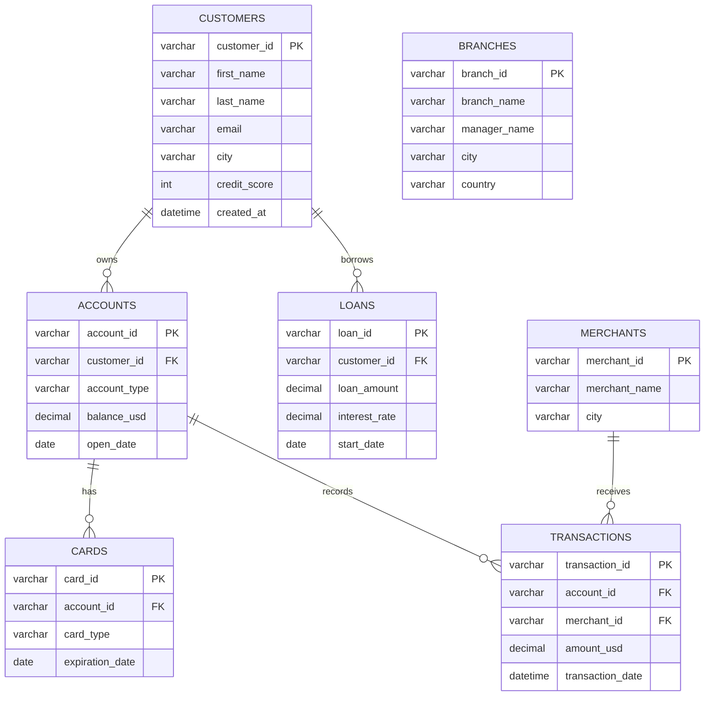

# PostgreSQL Banking System - Tổng Hợp Thiết Kế Kiến Trúc

## 1. Mục tiêu hệ thống
Hệ thống mô phỏng dữ liệu ngân hàng, phục vụ:
- Lưu trữ thông tin khách hàng, tài khoản, thẻ, khoản vay, chi nhánh, merchant.
- Theo dõi giao dịch phát sinh trên tài khoản.
- Hỗ trợ phân tích hành vi tài chính (chi tiêu, dư nợ, credit profile).

## 2. Kiến trúc tổng thể
Kiến trúc dự án hiện tại theo hướng ETL đơn giản:
1. Nguồn dữ liệu thô trong thư mục `csv/`.
2. Lớp mô tả schema trong `sql/schema.sql`.
3. Lớp seed dữ liệu trong các file `sql/*_inserts.sql`.
4. Cơ sở dữ liệu đích là `bank`.

Thành phần dữ liệu:
- CSV: dữ liệu đầu vào (có cấu trúc cột cố định).
- SQL schema: định nghĩa bảng và khóa ngoại.
- SQL inserts: nạp dữ liệu khởi tạo/khởi tạo test.

## 3. Mô hình dữ liệu logic (ER)
### Bảng và vai trò
- `customers`: Thông tin khách hàng cá nhân (identity + credit score).
- `accounts`: Tài khoản ngân hàng của khách hàng.
- `cards`: Thẻ gắn với tài khoản.
- `loans`: Khoản vay gắn với khách hàng.
- `merchants`: Đơn vị chấp nhận giao dịch.
- `transactions`: Giao dịch tài khoản tại merchant.
- `branches`: Danh sách chi nhánh (độc lập với flow giao dịch trong schema hiện tại).

### Quan hệ chính
- 1 `customer` -> N `accounts`
- 1 `customer` -> N `loans`
- 1 `account` -> N `cards`
- 1 `account` -> N `transactions`
- 1 `merchant` -> N `transactions`



## 4. Data Flow và thứ tự nạp dữ liệu
Thứ tự để đảm bảo toàn vẹn khóa ngoại:
1. `customers`
2. `merchants`
3. `branches`
4. `accounts` (phụ thuộc `customers`)
5. `cards` (phụ thuộc `accounts`)
6. `loans` (phụ thuộc `customers`)
7. `transactions` (phụ thuộc `accounts`, `merchants`)

Lưu ý: file `transactions_inserts.sql` có kích thước lớn (không đồng bộ được qua extension), cần chạy trực tiếp bằng psql/SQL client khi seed.

### 4.1. Data Flow bắt đầu từ customer (chi tiết)
Luồng nghiệp vụ có thể đọc theo trục customer như sau:

1. Khởi tạo customer
- Bản ghi được tạo trong bảng `customers` với `customer_id` là định danh gốc.
- Các thuộc tính nền tảng gồm hồ sơ cơ bản, `credit_score`, thời điểm tạo (`created_at`).

2. Mở tài khoản cho customer
- Mỗi customer có thể sở hữu nhiều account trong bảng `accounts`.
- Liên kết bằng `accounts.customer_id -> customers.customer_id`.
- Tại bước này hệ thống bắt đầu theo dõi số dư (`balance_usd`) và loại tài khoản (`account_type`).

3. Phát hành thẻ theo tài khoản
- Mỗi account có thể có nhiều thẻ trong bảng `cards`.
- Liên kết bằng `cards.account_id -> accounts.account_id`.
- Đây là lớp phương tiện thanh toán, nhưng dữ liệu giao dịch hiện tại vẫn đi qua trục account.

4. Cấp khoản vay cho customer (nhánh song song)
- Customer có thể có 0..N khoản vay trong bảng `loans`.
- Liên kết bằng `loans.customer_id -> customers.customer_id`.
- Nhánh này phản ánh dư nợ/tín dụng, độc lập với nhánh chi tiêu giao dịch.

5. Ghi nhận giao dịch chi tiêu
- Khi customer sử dụng tài khoản để thanh toán, giao dịch được ghi vào `transactions`.
- Mỗi giao dịch bắt buộc tham chiếu:
    - `transactions.account_id -> accounts.account_id`
    - `transactions.merchant_id -> merchants.merchant_id`
- Từ `transactions`, có thể truy ngược toàn bộ ngữ cảnh customer theo chuỗi:
    `transactions -> accounts -> customers`.

6. Truy vấn phân tích customer 360
- Gom dữ liệu hồ sơ: `customers`.
- Gom dữ liệu tài sản thanh toán: `accounts`, `cards`.
- Gom dữ liệu tín dụng: `loans`.
- Gom dữ liệu hành vi chi tiêu: `transactions` kết hợp `merchants`.

Tóm tắt theo quan hệ:
- Gốc định danh: `customers`
- Phân nhánh tài sản: `customers -> accounts -> cards`
- Phân nhánh tín dụng: `customers -> loans`
- Phân nhánh hành vi giao dịch: `customers -> accounts -> transactions -> merchants`

Ý nghĩa kiến trúc:
- `customers` là thực thể trung tâm để hợp nhất dữ liệu nghiệp vụ.
- `accounts` đóng vai trò cầu nối giữa hồ sơ khách hàng và dữ liệu giao dịch.
- Mô hình này hỗ trợ tốt cho các bài toán KYC, scoring, segmentation, fraud screening ở mức dữ liệu quan hệ.

## 5. Quy mô dữ liệu đầu vào (CSV)
- `customers.csv`: 50,000 rows
- `accounts.csv`: 75,000 rows
- `cards.csv`: 100,000 rows
- `loans.csv`: 30,000 rows
- `merchants.csv`: 5,000 rows
- `branches.csv`: 500 rows

Tổng quan cho thấy đây là bộ dữ liệu benchmark tầm trung, phù hợp test query join và aggregate.

## 6. Ràng buộc và toàn vẹn dữ liệu
Ràng buộc đã thể hiện trong schema:
- Primary key cho tất cả bảng nghiệp vụ.
- Foreign key cho các quan hệ cha-con (`accounts/customer`, `cards/account`, `loans/customer`, `transactions/account`, `transactions/merchant`).

Khuyến nghị bổ sung (nếu hướng đến production):
- `NOT NULL` cho các cột bắt buộc (`*_id`, `amount`, `dates`).
- `CHECK` constraints:
  - `credit_score BETWEEN 300 AND 850`
  - `loan_amount >= 0`
  - `balance_usd >= 0`
- Unique index cho `customers.email` (nếu dữ liệu nghiệp vụ yêu cầu duy nhất).

## 7. Kiến trúc truy vấn phân tích
Một số truy vấn tiêu biểu mà mô hình hiện tại hỗ trợ tốt:
- Customer 360: thông tin khách hàng + tài khoản + thẻ + vay.
- Tổng chi tiêu theo merchant/city/tháng.
- Xếp hạng khách hàng theo balance + credit score.
- Theo dõi phân bố account type (Savings/Checking/Business).

Khuyến nghị index cho PostgreSQL:
- `accounts(customer_id)`
- `cards(account_id)`
- `loans(customer_id)`
- `transactions(account_id)`
- `transactions(merchant_id)`
- `transactions(transaction_date)`

## 8. Ghi chú tương thích PostgreSQL
Dự án đặt tên PostgreSQL, tuy nhiên schema hiện tại có một số cú pháp gần MySQL:
- `USE bank;` không dùng trong PostgreSQL.
- Kiểu `DATETIME` nên đổi sang `TIMESTAMP` trong PostgreSQL.

Hướng chuyển đổi nhanh:
- Tạo DB bằng lệnh psql: `CREATE DATABASE bank;`
- Kết nối vào DB (`\c bank`) rồi chạy script schema/insert.
- Đổi `DATETIME` -> `TIMESTAMP` trong file schema và insert (nếu cần).

## 9. Cấu trúc thư mục dự án
```text
csv/
  accounts.csv
  branches.csv
  cards.csv
  customers.csv
  loans.csv
  merchants.csv
sql/
  schema.sql
  *_inserts.sql
  bank.sql
database/
```

## 10. Kết luận
Thiết kế hiện tại theo mô hình relational rõ ràng, phân tách tốt giữa dữ liệu master (`customers`, `accounts`, `merchants`) và dữ liệu sự kiện (`transactions`).
Nên cấu hình lại một số cú pháp SQL để hoàn toàn tương thích PostgreSQL trước khi đưa vào pipeline chạy thật.
